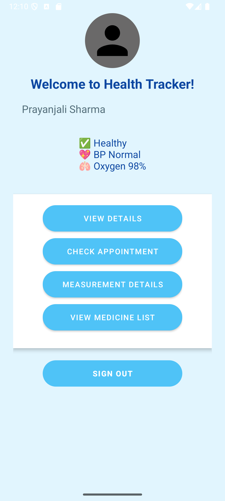
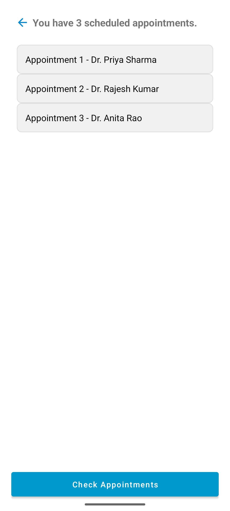
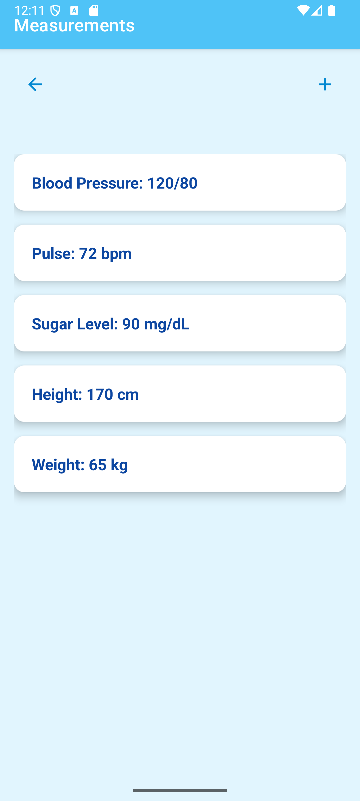
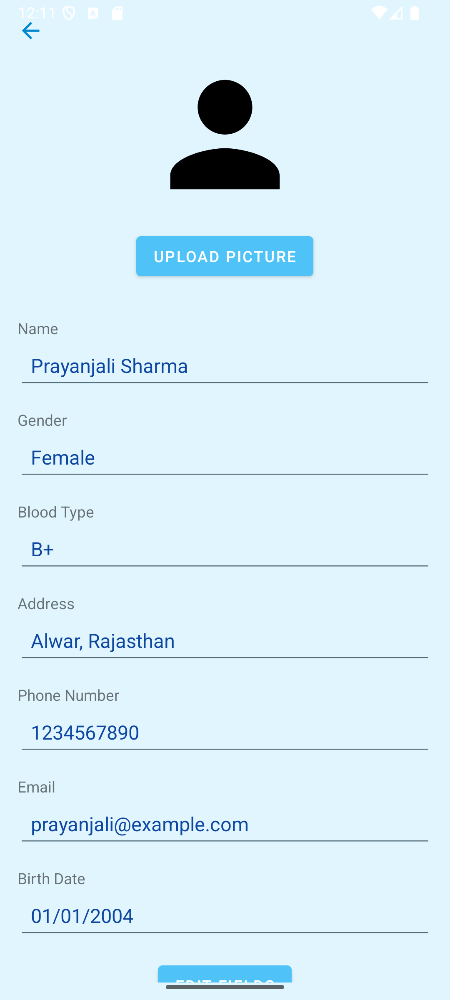

# 📱 Health Recorder Android App

Health Recorder is a user-friendly Android application designed to help users manage their health data including appointments, body measurements, and basic health info. The app is designed with accessibility in mind and features a clean UI for smooth navigation.

---

## 📌 Features

- 🏠 **Home Page** — Simple and welcoming user interface.
- 📋 **Doctor Appointments** — View and manage upcoming medical appointments.
- ⚖️ **Measurements** — Record height, weight, and other body metrics.
- ℹ️ **Get Info** — Learn about healthy practices and app usage.
- 🔙 **Back Navigation** — Seamless transition using back buttons.

---

## 📸 Screenshots

### 🏠 Home Screen

---

### ⛑️ Main Page

---

### 📅 Appointments Page

---

### 📐 Measurements Page

---

### ℹ️ Get Info Page

---

## 🛠️ Technologies Used

- Java (Android)
- XML for UI layouts
- Android Studio
- Material Components
- Accessibility-friendly components
